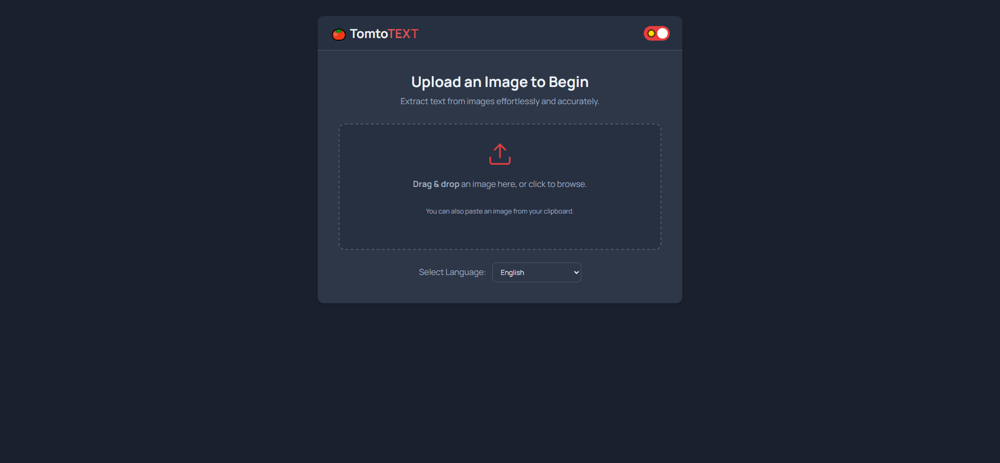
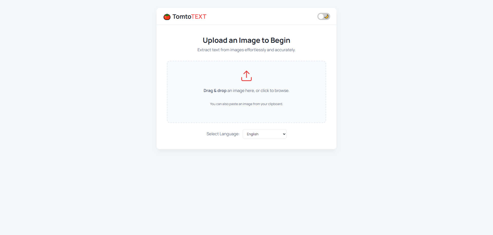

# 🍅 TomtoTEXT

[](https://github.com/hasanulhossaint/TomtoTEXT)
[](https://opensource.org/licenses/MIT)
[](https://developer.mozilla.org/en-US/docs/Web/JavaScript)
[](https://nodejs.org/)
[](https://en.wikipedia.org/wiki/Bangladesh)

> TomtoTEXT: A modern, privacy-focused web tool for instantly converting images to editable text and translating languages right in your browser.

---

## 🌐 Live Demo

- **GitHub Pages:** [**hasanulhossaint.github.io/tomtotext/**](https://hasanulhossaint.github.io/tomtotext/)

---

## 🖼️ Screenshots

| Dark Mode | Light Mode |
| :---: | :---: |
|  |  |

---

## ✨ Key Features

- **Instant OCR**: Utilizes Tesseract.js to accurately extract text from images directly on the client-side.
- **Privacy-Focused**: Images are processed in your browser and are never uploaded to a server, ensuring your data remains private.
- **Multi-Language Support**: Supports a wide range of languages, with optimized performance for English and Bengali.
- **Automatic Translation**: Instantly translates extracted Bengali text to English via a secure backend service.
- **Modern UI/UX**:
    - Sleek, responsive design that works on all devices.
    - **Dark Mode** to reduce eye strain, with your preference saved locally.
    - Intuitive **drag-and-drop** and **paste-from-clipboard** functionality.
- **Rich Feedback**:
    - Live image preview before processing.
    - Real-time progress bar and status updates.
    - Detailed **word and character counts** of the extracted text.

---

## 💡 How It Works

This application uses a hybrid architecture to maximize both privacy and functionality:

1.  **Client-Side OCR**: When you upload an image, all Optical Character Recognition is performed directly in your web browser using **Tesseract.js**. Your image file never leaves your computer, guaranteeing the privacy of your data.

2.  **Server-Side Translation**: For translation, the extracted text is sent to a lightweight **Node.js backend server**. This server acts as a secure proxy, adding the secret API key before forwarding the request to the Google Translate API. This prevents exposing sensitive keys on the frontend.

---

## 🛠️ Tech Stack

| Category      | Technology                                                                                                   | Description                                                |
| :------------ | :----------------------------------------------------------------------------------------------------------- | :--------------------------------------------------------- |
| **Frontend** | `HTML5`, `CSS3`, `Vanilla JavaScript`                                                                        | For structure, styling, and all client-side interactivity. |
| **OCR Engine**| `Tesseract.js`                                                                                               | The powerful OCR library that runs directly in the browser.    |
| **Backend** | `Node.js`, `Express.js`                                                                                      | For the secure backend proxy server that handles translations. |
| **Translation**| `Google Cloud Translate API`                                                                                   | For powerful and accurate text translation.                |

---

## 🚀 Getting Started

To get a local copy up and running, follow these simple steps.

### **Prerequisites**

* **Node.js** (v16 or later recommended): [Download Node.js](https://nodejs.org/)
* A code editor like **Visual Studio Code** with the **Live Server** extension.

### **Installation & Setup**

1.  **Clone the repository:**
    ```bash
    git clone https://github.com/hasanulhossaint/TomtoTEXT.git
    cd TomtoTEXT
    ```

2.  **Set up the Backend (Translation Server):**
    * Navigate to the directory containing your `server.js` file.
    * Install the required NPM packages:
        ```bash
        npm install express cors @google-cloud/translate
        ```
    * **Crucial:** You must set up your Google Cloud API credentials. For local development, the recommended approach is to use [Google Application Default Credentials](https://cloud.google.com/docs/authentication/provide-credentials-adc).

3.  **Run the Application:**
    * **Start the Backend Server:** Open a terminal in the server directory and run:
        ```bash
        node server.js
        ```
        Your translation server should now be running at `http://localhost:3000`.

    * **Start the Frontend:** In VS Code, right-click the `index.html` file and select **"Open with Live Server"**. This will open the web app in your browser.

---

## 🗺️ Roadmap

Here are some potential features planned for future versions:

- [ ] **Batch Processing:** Allow users to upload and process multiple images at once.
- [ ] **Export Results:** Add options to download extracted text as `.txt` or `.pdf` files.
- [ ] **Processing History:** Save recent OCR tasks to `localStorage` for easy access.
- [ ] **User Accounts:** Introduce optional user accounts to sync history across devices.

---

## 🤝 Contributing

Contributions are what make the open-source community such an amazing place to learn, inspire, and create. Any contributions you make are **greatly appreciated**.

If you have a suggestion that would make this better, please fork the repo and create a pull request. You can also simply open an issue with the tag "enhancement".

1.  Fork the Project
2.  Create your Feature Branch (`git checkout -b feature/AmazingFeature`)
3.  Commit your Changes (`git commit -m 'Add some AmazingFeature'`)
4.  Push to the Branch (`git push origin feature/AmazingFeature`)
5.  Open a Pull Request

---

## 📜 License

Distributed under the MIT License. See the `LICENSE` file for more information.

---

<div align="center">

### Connect with the Creator

<p>
  <a href="https://github.com/hasanulhossaint">
    
  </a>
  <a href="https://www.linkedin.com/in/hasanulhossaintomal/">
    
  </a>
  <a href="mailto:hasanulhossaintomal@gmail.com">
    
  </a>
</p>

Created by **Hasanul Hossain Tomal**

</div>
